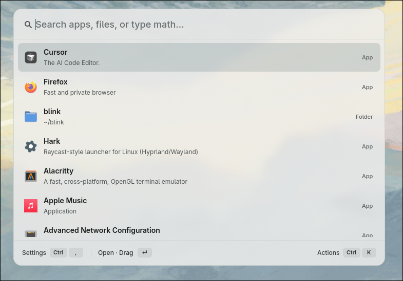

<p align="center">
  
</p>

<h1 align="center"><b>Hark</b></h1>
<h4 align="center">A fast, native command palette for Linux</h4>

<p align="center">
  <a href="https://github.com/Vedant9500/Hark/releases"></a>
  <a href="https://github.com/Vedant9500/Hark/blob/master/LICENSE"></a>
  <a href="https://github.com/Vedant9500/Hark"></a>
</p>



**Hark** (pronounced _"hark"_, from the archaic _hark!_ — pay attention, come) is a
resident-daemon launcher for Linux built with GTK4. One keystroke summons an overlay
that searches your apps, files, math, conversions, and more — before you finish typing.

Out of the box, Hark is:

- **app search** — fuzzy-match `.desktop` entries
- **file / folder search** — type a name, a `f query`, or a path like `~/Doc`
- **calculator** — `2+2`, `sqrt(144)`, `5k + 2m`, `15% of 80`, `tip 20% on 45`
- **unit conversion** — `100 km to mi`, `32 f to c`, `1 gb to mb`
- **currency / FX** — live rates (Frankfurter/ECB, cached), `100 usd to eur`
- **timezones & time ranges** — `15:00 here to tokyo`, `7:26 - 9:32`
- **battery / power status** — `battery`, `power`, `charging`
- **online translation** — `tr Hola`, `tr en es Hello`, or paste foreign script
- **typo learning** — learns from your launches (`wats` → WhatsApp)
- **media preview, drag-and-drop, Open With, themes**

## Installation

### AUR

```bash
paru -S hark      # or your AUR helper of choice
```

### One-line installer

```bash
curl -fsSL https://github.com/Vedant9500/Hark/releases/latest/download/install.sh | bash

# optionally enable login autostart of the daemon
curl -fsSL https://github.com/Vedant9500/Hark/releases/latest/download/install.sh | bash -s -- --autostart
```

### Portable `.tar.gz`

For machines without Rust or an AUR helper — only GTK4 is needed:

```bash
tar xzf hark-0.1.0-x86_64-linux.tar.gz
./hark-0.1.0-x86_64-linux/install.sh
```

### From source

```bash
# dependencies (Arch)
sudo pacman -S gtk4 gtk4-layer-shell

./scripts/install.sh
# or
cargo build --release --features layer-shell
```

### Requirements

- Linux x86_64
- GTK 4 (`gtk4` / `libgtk-4-1`)
- Recommended on Hyprland: `gtk4-layer-shell` for true overlay mode

## Usage

Hark runs as a **resident daemon** so the hotkey path avoids cold GTK startup. By
default **Alt+A** summons the overlay.

| Keys | Action |
|------|--------|
| `Alt+A` | Toggle overlay (if bound) |
| `↑` / `↓` | Navigate results |
| `Tab` | Autocomplete |
| `Enter` | Open / copy |
| `Ctrl+K` | Secondary actions (Open With, copy path, reveal, trash) |
| `Ctrl+Alt+Enter` | Open terminal at folder |
| `Ctrl+C` | Copy calc / conversion result |
| `Ctrl+,` | Settings |
| `Esc` | Close |

### Hyprland

```lua
-- execs.lua (preload, no window)
hl.exec_cmd("hark --daemon")

-- keybinds.lua (toggle)
hl.bind(vars.kbHark, hl.dsp.exec_cmd("hark"))
```

Or in `hyprland.conf`:

```conf
exec-once = hark --daemon
bind = ALT, A, exec, hark
```

## Documentation

- [docs/](docs/) — index of metrics, bench logs, and archive
- [docs/performance.md](docs/performance.md) — latency snapshot, bench how-to
- [docs/TRANSLATE.md](docs/TRANSLATE.md) — translate languages, aliases, auto-detect
- [packaging/](packaging/) — desktop entry, user installer, AUR `PKGBUILD`

## License

MIT
